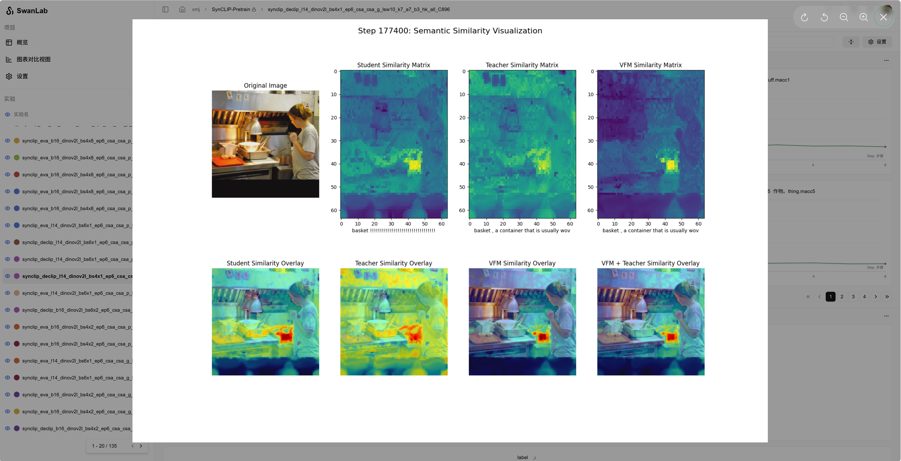

<h2 align="center">
  [CVPR 2026] SynCLIP: Synonym-Coherent Language-Image Pretraining for Robust Open-Vocabulary Dense Perception
</h2>

<p align="center">
  <a href="https://openaccess.thecvf.com/content/CVPR2026/html/Xie_SynCLIP_Synonym-Coherent_Language-Image_Pretraining_for_Robust_Open-Vocabulary_Dense_Perception_CVPR_2026_paper.html"></a>
  <a href="https://arxiv.org/abs/2607.11008"></a>
  <a href="#citation"></a>
</p>

<p align="center">
  <a href="#installation">Installation</a> |
  <a href="#data-preparation">Data</a> |
  <a href="#checkpoint-preparation">Checkpoints</a> |
  <a href="#pretraining">Pretraining</a> |
  <a href="#downstream-validation">Validation</a> |
  <a href="#citation">Citation</a>
</p>


## Abstract

Open-vocabulary dense perception (OVDP) aims to localize objects unseen during training by leveraging textual knowledge. Despite the remarkable progress of recent CLIP-based approaches, we identify a critical limitation: **synonym-induced grounding inconsistency**, where semantically equivalent expressions yield disparate spatial attention patterns. This inconsistency undermines the robustness and performance of existing methods in real-world OVDP applications.

To address this issue, we propose **SynCLIP**, a **Synonym-Coherent Language-Image Pretraining** framework that enhances synonym-robust grounding for OVDP tasks. SynCLIP introduces a **Semantic-consistent Spatial Attention alignment (SSA)** module to enhance spatial attention consistency by minimizing discrepancies between attention maps of original and synonymous expressions. Furthermore, a **Spatial Attention Refinement (SAR)** module selectively strengthens the most semantically relevant spatial regions within aligned maps, resulting in more precise and stable grounding. To support synonym-coherent pretraining, we also construct a **Synonym-Enriched Visual Corpus (SEViC)**, which augments each category with multiple synonyms and textual definitions. Extensive experiments on multiple benchmarks demonstrate that SynCLIP substantially improves grounding consistency under diverse linguistic variants and achieves state-of-the-art performance among CLIP-based OVDP methods.

## Installation

Clone this repository and install the required packages.

```bash
git clone https://github.com/Justlovesmile/SynCLIP.git
cd SynCLIP

conda create -n synclip python=3.10 -y
conda activate synclip
pip install -r requirements.txt
pip install -e . -v

# Blow for F-ViT (see F-ViT/README.md)
cd ./F-ViT/mmcv-1.7.0
MMCV_WITH_OPS=1 pip install -e . -v
cd ../../

cd ./F-ViT/mmdetection-2.28.1
pip install -e . -v
cd ../../
```

The main environment used by this repository is based on PyTorch 2.7.1 and torchvision 0.22.1. Please install CUDA-compatible PyTorch wheels if your local CUDA version requires a different build.

## Data Preparation

The main experiments are conducted on [COCO](https://cocodataset.org/#home) and [LVIS](https://www.lvisdataset.org/). The SynCLIP distillation stage only requires images and expressions from SEViC. The downstream finetuning stage follows the OV-COCO and OV-LVIS settings used by [CLIPSelf](https://github.com/wusize/CLIPSelf) and [DeCLIP](https://github.com/xiaomoguhz/DeCLIP).

Please organize the datasets as follows. The capitalization of `Annotations` and `Images` matches the provided training scripts.

```text
SynCLIP/
|-- data/
|   |-- coco/
|   |   |-- Annotations/
|   |   |   |-- instances_train2017.json              # used to access training images
|   |   |   |-- lvis_coco_categories_train2017.json   # category labels for SEViC
|   |   |   |-- panoptic_val2017.json                 # COCO panoptic validation annotations
|   |   |   |-- panoptic_val2017/                     # COCO panoptic validation masks
|   |   |   `-- sevic.json                            # synonyms and definitions
|   |   `-- Images/
|   |       |-- train2017/
|   |       `-- val2017/
|   `-- lvis_v1/
|       |-- Annotations/
|       |   `-- lvis_v1_train.json                    # used to access LVIS training images
|       `-- Images/
|           |-- train2017/                            # can be linked to COCO train2017
|           `-- val2017/                              # can be linked to COCO val2017
```

## Checkpoint Preparation

Download the pretrained weights from [EVA-CLIP](https://github.com/baaivision/EVA/tree/master/EVA-CLIP), [DeCLIP](https://github.com/xiaomoguhz/DeCLIP), and [DINOv2](https://github.com/facebookresearch/dinov2). Put them under `ckpts/`.

```text
SynCLIP/
`-- ckpts/
    |-- EVA02_CLIP_B_psz16_s8B.pt
    |-- EVA02_CLIP_L_336_psz14_s6B.pt
    |-- DeCLIP_EVA-B_DINOv2-B_csa_0.05_2.0.pt
    |-- DeCLIP_EVA-L_DINOv2-L_csa_0.05_2.0.pt
    |-- dinov2_vitb14_reg4_pretrain.pth
    `-- dinov2_vitl14_reg4_pretrain.pth
```

## Pretraining

We provide distributed training scripts under `scripts/`. Before launching a job, update the dataset path, checkpoint path, visible GPUs, and output name in the script if necessary.

For SynCLIP pretraining with EVA02-CLIP-B/16 on COCO:

```bash
bash scripts/dist_SynCLIP_eva_vitb16_coco.sh
```

The script expects:

- COCO data at `data/coco/`
- SEViC expressions at `data/coco/Annotations/sevic.json`
- category names at `data/coco/Annotations/lvis_coco_categories_train2017.json`
- EVA02-CLIP-B/16 weights at `ckpts/EVA02_CLIP_B_psz16_s8B.pt`

Consider turning on `--swanlab` to monitor the training progress in real-time with [swanlab](https://swanlab.cn/).



Checkpoints are saved under the experiment directory configured by `exp_name`.

## Downstream Validation

### Open-Vocabulary Detection with F-ViT

F-ViT finetuning is provided in `F-ViT/`. Edit `F-ViT/run_train.sh` to set `synclip_workdir`, `exp_name`, and the number of GPUs for your machine, then run:

```bash
cd F-ViT
bash run_train.sh
```

The script loads the SynCLIP checkpoint from:

```text
${synclip_workdir}/${exp_name}/checkpoints/epoch_6.pt
```

### Open-Vocabulary Segmentation with CAT-Seg

SynCLIP can also be transferred to CAT-Seg-style open-vocabulary segmentation pipelines. Please set the SynCLIP checkpoint in the corresponding CAT-Seg configuration before launching validation or finetuning.

## Repository Structure

```text
SynCLIP/
|-- assets/                 # figures and visual assets
|-- ckpts/                  # pretrained and released checkpoints
|-- data/                   # COCO, LVIS, and SEViC annotations
|-- scripts/                # SynCLIP pretraining scripts
|-- logs/                   # pretraining entry points and training logic
|-- F-ViT/                  # open-vocabulary detection validation
|-- CAT-Seg/                # open-vocabulary segmentation validation
`-- README.md
`-- requirements.txt
`-- setup.py
```

## Acknowledgement

This work is built on many excellent research works and open-source projects. We thank the authors for sharing their code and models.

<p>
  <a href="https://github.com/mlfoundations/open_clip">OpenCLIP</a> |
  <a href="https://github.com/baaivision/EVA/tree/master/EVA-CLIP">EVA-CLIP</a> |
  <a href="https://github.com/open-mmlab/mmdetection">MMDetection</a> |
  <a href="https://github.com/wusize/CLIPSelf">CLIPSelf</a> |
  <a href="https://github.com/xiaomoguhz/DeCLIP">DeCLIP</a> |
  <a href="https://github.com/facebookresearch/dinov2">DINOv2</a>
</p>

## Citation

If you find this project useful in your research, please consider starring the repository and citing our paper.

```bibtex
@InProceedings{Xie_2026_CVPR,
    author    = {Xie, Mingjie and He, Guangjun and Xu, Dongli and Lin, Youtian and Li, Hongjue and Feng, Pengming and Guan, Jian and Deng, Yue},
    title     = {SynCLIP: Synonym-Coherent Language-Image Pretraining for Robust Open-Vocabulary Dense Perception},
    booktitle = {Proceedings of the IEEE/CVF Conference on Computer Vision and Pattern Recognition (CVPR)},
    month     = {June},
    year      = {2026},
    pages     = {31524-31533}
}
```
