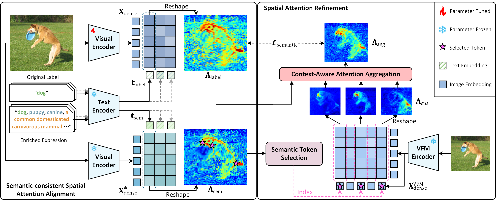

<h2 align="center">
SynCLIP: Synonym-Coherent Language-Image Pretraining for Robust Open-Vocabulary Dense Perception
</h2>

<h3 align="center"><b> CVPR 2026 Accept </b></h3>


<p align="center">
  <a href="#abstract">Abstract</a> |
  <a href="#dataset">Dataset</a> |
  <a href="#model">Model</a> |
  <a href="#statement">Statement</a>
</p>



## Abstract
Open-vocabulary dense perception (OVDP) aims to localize objects unseen during training by leveraging textual knowledge. Despite the remarkable progress of recent CLIP-based approaches, we identify a critical limitation: synonym-induced grounding inconsistency, where semantically equivalent expressions yield disparate spatial attention patterns. This inconsistency undermines the robustness and performance of existing methods in real-world OVDP applications. To address this issue,  we propose SynCLIP, a Synonym-Coherent Language-Image Pretraining framework that enhances synonym-robust grounding for OVDP tasks. SynCLIP introduces a Semantic-consistent Spatial Attention alignment (SSA) module to enhance spatial attention consistency by minimizing discrepancies between attention maps of original and synonymous expressions. Furthermore, a Spatial Attention Refinement (SAR) module selectively strengthens the most semantically relevant spatial regions within aligned maps, resulting in more precise and stable grounding. To support synonym-coherent pretraining, we also construct a Synonym-Enriched Visual Corpus (SEViC), which augments each category with multiple synonyms and textual definitions. Extensive experiments on multiple benchmarks demonstrate that SynCLIP substantially improves grounding consistency under diverse linguistic variants and achieves state-of-the-art performance among CLIP-based OVDP methods.

## Dataset

The main experiments are conducted based on [COCO](https://cocodataset.org/#home) and [LVIS](https://www.lvisdataset.org/) datasets. Please prepare datasets and organize them like the following:

```
SynCLIP/
├── dataset
    ├── coco
        ├── annotations
            ├── instances_train2017.json  # only access images
            ├── sevic.json             # only access synonyms and definitions 
            ├── panoptic_val2017.json  # for validation
            ├── panoptic_val2017       # for validation
        ├── train2017
        ├── val2017
    ├── lvis_v1
        ├── annotations
            ├── lvis_v1_train.json  # only access images
        ├── train2017    # the same with coco
        ├── val2017      # the same with coco
```

The distillation process of SynCLIP only requires images and expressions from SEViC. The downstream finetuning process of SynCLIP is built on OV-COCO and OV-LVIS, following [CLIPSelf](https://github.com/wusize/CLIPSelf) and [DeCLIP](https://github.com/xiaomoguhz/DeCLIP).

## Model

Please download the pretrained weights from [EVA-CLIP](https://github.com/baaivision/EVA/tree/master/EVA-CLIP),  [DeCLIP](https://github.com/xiaomoguhz/DeCLIP) and [DINOv2](https://github.com/facebookresearch/dinov2) and organize them as shown below.

```
SynCLIP/
├── ckpts
    ├── EVA02_CLIP_B_psz16_s8B.pt
    ├── EVA02_CLIP_L_336_psz14_s6B.pt
    ├── DeCLIP_EVA-B_DINOv2-B_csa_0.05_2.0.pt
    ├── DeCLIP_EVA-L_DINOv2-L_csa_0.05_2.0.pt
    ├── dinov2_vitb14_reg4_pretrain.pth
    ├── dinov2_vitl14_reg4_pretrain.pth
```


## Statement

### Acknowledgement

This work is built on many amazing research works and open-source projects, thanks a lot to all the authors for sharing!
<p>
  <a href="https://github.com/mlfoundations/open_clip">OpenCLIP</a> |
  <a href="https://github.com/baaivision/EVA/tree/master/EVA-CLIP">EVA-CLIP</a> |
  <a href="https://github.com/open-mmlab/mmdetection">MMDetection</a> |
  <a href="https://github.com/wusize/CLIPSelf">CLIPSelf</a> |
  <a href="https://github.com/xiaomoguhz/DeCLIP">DeCLIP</a> |
  <a href="https://github.com/facebookresearch/dinov2">DINOv2</a>
</p>

### Citation

If you find our work useful in your research, please consider giving a star :star: and citing the following paper :pencil:.

```bibTex
@inproceedings{xie2026synclip,
  title={SynCLIP: Synonym-Coherent Language-Image Pretraining for Robust Open-Vocabulary Dense Perception},
  author={Xie, Mingjie and He, Guangjun and Xu, Dongli and Lin, Youtian and Li, Hongjue and Feng, Pengming and Guan, Jian and Deng, Yue},
  booktitle={Proceedings of the IEEE/CVF Conference on Computer Vision and Pattern Recognition},
  year={2026}
}
```